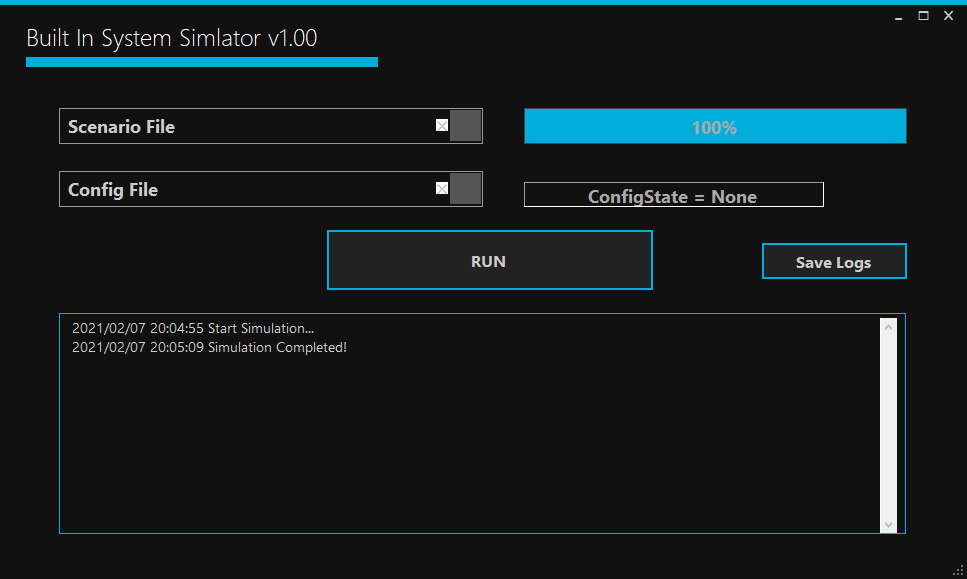

# BuiltInSystemSimulator
[WIP] This is Built-In System Simulator for C/C++ S/W (or dll)

# Enviroment
 Visual Studio 2019
 
# What's this ?
 This is built-in system simulator for C/C++ S/W.
 1. model.task.add_task(C/C++ Function);
 2. UI -> sim_main() -> model.task.main()

Image is 2.

